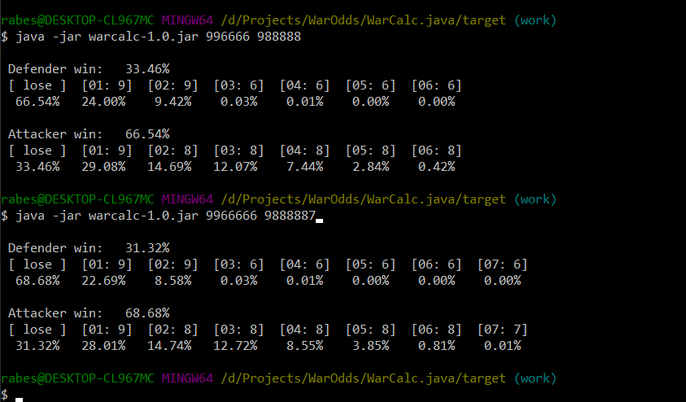

# WarCalc battle odds calculator

WarCalc is console application to calculate battle odds for old Warlords Classic game.
The calculator is also suitable to calculate odds for Warlords Classic for iPad game.

The main purpose of the program was develop and test new algorithm. The previous algorithm used Monte Carlo method and was not fast and accurate. Instead of the Monte Carlo method the new algorithm implement analytic calculation of battle odds for any sizes of armies.

You can use calculator by run console command:

```bash
java -jar  warcalc-1.0.jar <defender army> <attacker army>
```

The <defender army> and <attacker army> are strings of digits represent strength of units in the armies. 
Defender army may have from 1 to 32 units while attacking army only from 1 to 8 units. The most valuable units 
are left and most weaker and cheaper at the right.

## Examples of use

